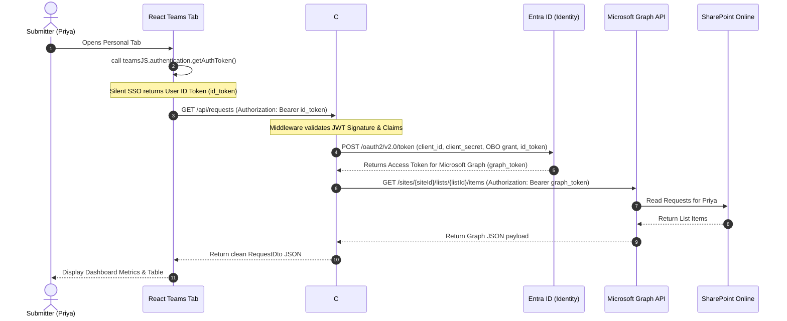

# Technical Architecture — Microsoft 365 Request & Document Manager

This document defines the technical design and architectural boundaries of the **Microsoft 365 Request & Document Manager** application.

---

## 1. Architectural Invariants

As defined in the project's [ARCHITECTURE-SPINE.md](file:///C:/Users/UsamaSuhaib/.gemini/antigravity-ide/brain/e9f99fa6-37fa-4253-96aa-8ae26a999238/ARCHITECTURE-SPINE.md), the system complies with the following invariants:

1. **AD-1 (Shared Data Isolation):** The React frontend must never execute Graph or SharePoint REST calls directly. All data access must route through the secure Azure Functions API.
2. **AD-2 (OAuth 2.0 On-Behalf-Of Flow):** The Azure Functions backend must validate the incoming Entra ID JWT user access token and exchange it for a Microsoft Graph token using the On-Behalf-Of flow.
3. **AD-3 (Relational Integrity in SharePoint Lists):** The backend service layer must programmatically validate list relationships and handle cascade operations since SharePoint lacks referential integrity.
4. **AD-4 (API Request Idempotency):** The POST `/api/requests` endpoint must require a `Client-Request-Id` UUID header to prevent double-creation.
5. **AD-5 (File Isolation and Access Control):** Documents are stored in subfolders named after the Request Number (`REQ-XXXXX/`). Files are downloaded via a secure proxy endpoint checking user authorization.

---

## 2. Design Paradigm: Layered Hexagonal (Ports & Adapters)

The backend code uses a layered hexagonal approach to prevent tight coupling with the Microsoft Graph SDK and C# HTTP presentation structures:

```
┌─────────────────────────────────────────────────────────────┐
│                   PRESENTATION (Http Adapters)              │
│                Functions / Controllers (C# HTTP)            │
├─────────────────────────────────────────────────────────────┤
│                 APPLICATION CORE (Ports)                    │
│     Services (IRequestService) & DTOs (RequestDto)          │
├─────────────────────────────────────────────────────────────┤
│                 INFRASTRUCTURE (Graph Adapters)             │
│            ISharePointRepository -> GraphServiceClient       │
└─────────────────────────────────────────────────────────────┘
```

- **Domain/Core (Ports):** Contains interface contracts (e.g. `ISharePointRepository`, `IMailService`), entities, and validators. This layer has zero dependencies on Azure Functions runtime or Graph SDK assemblies.
- **Presentation (Primary Adapters):** Contains C# isolated-worker HTTP triggers (e.g. `GetRequestsFunction`, `CreateRequestFunction`).
- **Infrastructure (Secondary Adapters):** Implements ports using the Microsoft Graph .NET SDK (e.g. `GraphSharePointRepository`).

---

## 3. Sequence Flow: SSO & On-Behalf-Of Token Swap

Below is the authentication flow and access path used when a user opens the Teams tab dashboard:



---

## 4. REST API Endpoint Catalog

| HTTP Method | Route | Description | Auth Required | Idempotent |
| :--- | :--- | :--- | :---: | :---: |
| **GET** | `/api/health` | Service health status | No | Yes |
| **GET** | `/api/me` | Fetch active user info from token | Yes | Yes |
| **GET** | `/api/requests` | Fetch requests created by/assigned to user | Yes | Yes |
| **GET** | `/api/requests/{id}` | Fetch request details | Yes | Yes |
| **POST** | `/api/requests` | Create request (Title, Category, etc.) | Yes | Yes (UUID) |
| **PUT** | `/api/requests/{id}` | Update request details | Yes | No |
| **POST** | `/api/requests/{id}/submit` | Transition request from Draft to Submitted | Yes | No |
| **POST** | `/api/requests/{id}/approve` | Approve request (Approvers only) | Yes | No |
| **POST** | `/api/requests/{id}/reject` | Reject request (Approvers only) | Yes | No |
| **GET** | `/api/requests/{id}/documents` | Fetch document attachments for request | Yes | Yes |
| **POST** | `/api/requests/{id}/documents`| Upload document attachment | Yes | No |
| **GET** | `/api/requests/{id}/comments` | Get list of comments | Yes | Yes |
| **POST** | `/api/requests/{id}/comments` | Add new comment | Yes | No |
| **POST** | `/api/outlook/create-request` | Create request from email context | Yes | Yes (UUID) |
