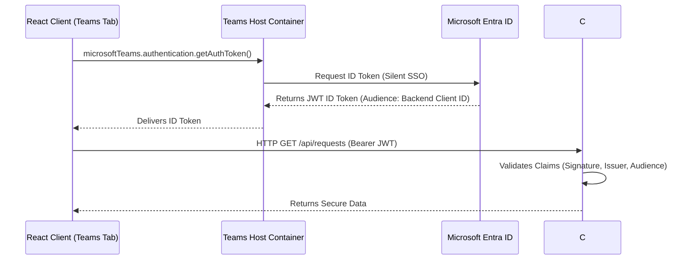

# M365 Integration Notes — Auth, Graph, SharePoint & Teams

This document provides a technical summary of the Microsoft 365 developer ecosystem patterns, authentication models, and API endpoints utilized in the **Request & Document Manager** application.

---

## 🔐 1. Authentication & Identity (Entra ID)

To enable seamless user experiences with native audit trails, the application implements **OAuth 2.0 Single Sign-On (SSO)**:

### Teams Tab Silent SSO Flow


### Authentication Invariants (Verified in Middleware)
*   **Audience (`aud`):** Must match the Backend client registration ID: `api://{ClientId}`.
*   **Issuer (`iss`):** Must match the tenant-specific Entra endpoint: `https://login.microsoftonline.com/{TenantId}/v2.0`.
*   **Signatures:** Checked against signing keys fetched dynamically from Microsoft's public keys endpoint: `https://login.microsoftonline.com/common/discovery/v2.0/keys`.

---

## 🌐 2. Microsoft Graph APIs

Microsoft Graph is the unified gateway to access data across M365 services. We interface with it using the **Microsoft Graph .NET SDK**:

*   **Endpoint Base:** `https://graph.microsoft.com/v1.0`
*   **Key Operations:**
    *   **User Details:** `GET /me` (Retrieves name, email, department, and profile photo).
    *   **Delegated Token Swap (OBO):** Exchanges the incoming frontend JWT for a delegated Graph token to act on behalf of the user, preserving user-level audit trails.

---

## 📂 3. SharePoint Integration (Lists & Document Libraries)

The application uses SharePoint Online as a secure, structured database and attachment repository:

### Tabular Storage (SharePoint Lists)
*   **API Route:** `POST /sites/{siteId}/lists/{listId}/items`
*   **Data Structure:** Fields map request metadata (Title, Description, Category, Priority, Status, Approver Notes).
*   **Benefits:** Low-cost storage, native M365 indexing, version history, and compliance out of the box.

### Attachment Isolation (Drive/Folder Items)
*   **Structure:** Documents are kept in an isolated folder hierarchy under a document library:
    `RequestDocuments / REQ-{RequestId} / {fileName}`
*   **API Routes:**
    *   **Folder Creation:** `POST /sites/{siteId}/drives/{driveId}/root/children` (Payload: Folder metadata).
    *   **File Upload:** `PUT /sites/{siteId}/drives/{driveId}/root:/{folderPath}/{fileName}:/content` (Streams binary files).
    *   **Proxy Download Gateway:** Fronted by our API controller (`/api/requests/{id}/documents/{docId}`) to enforce security policies and prevent users from exposing raw SharePoint URLs.

---

## 💬 4. Teams Channel Notifications (Collaboration Loop)

To notify approvers of pending requests, the app triggers proactive channel notifications:

### Integration API
*   **API Route:** `POST /teams/{teamId}/channels/{channelId}/messages`
*   **Payload:** Encapsulates an **Adaptive Card** JSON schema.

### Message Card Payload (Example Schema)
```json
{
  "type": "message",
  "attachments": [
    {
      "contentType": "application/vnd.microsoft.card.adaptive",
      "content": {
        "type": "AdaptiveCard",
        "version": "1.4",
        "body": [
          { "type": "TextBlock", "text": "New Pending Approval", "weight": "bolder", "size": "medium" },
          { "type": "FactSet", "facts": [
              { "title": "Request:", "value": "REQ-00003" },
              { "title": "Priority:", "value": "High" }
            ]
          }
        ],
        "actions": [
          {
            "type": "Action.Submit",
            "title": "Approve",
            "data": { "action": "approve", "requestId": 3 }
          }
        ]
      }
    }
  ]
}
```
*   **Interactive Webhooks:** Users click "Approve" directly inside the Teams message card, which POSTs the action payload back to our backend approval controller, updating the request state dynamically!
